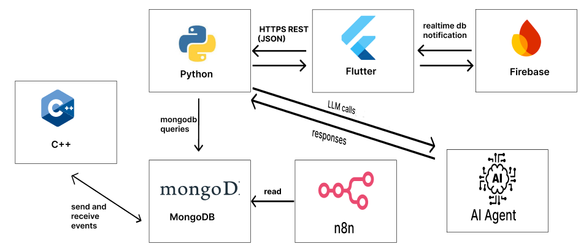

  

<!-- project overview -->

- HearYou is a smart safety system designed to support deaf and hard-of-hearing mothers, it helps them stay aware of important events at home, like when the baby cries, someone knocks on the door, or a phone call comes in and other important events.
- The system works with two main parts: mobile application and physical bracelet.

  

<!-- System Design -->

- Component Diagram

  

- ER Diagram

  
<!-- Project Highlights -->

**The Most Remarkable Features**

- **Seamless IoT Data Ingestion:** The system captures and securely stores real-time energy consumption data from client devices using ESP32 microcontrollers.  

- **AI-Powered Consumption Forecasting:** Advanced AI models analyze historical patterns to help energy providers anticipate demand and optimize resource allocation.  

- **Personalized AI Optimization Plans:** Clients receive intelligent, data-driven strategies to optimize energy usage, reduce costs, and promote sustainability based on their consumption behaviors.  

  

<!-- Demo -->

### User Screens (Mobile)

| Login screen                            | settings screen                       | ai agent screen                       |
| --------------------------------------- | ------------------------------------- | ------------------------------------- |
|           |          |         |

| ml baby movement                        | live video streaming                  |  notification                               |
| --------------------------------------- | ------------------------------------- | -------------------------------------       |
|  |          |   |

| bracelet prototype                         | bracelet prototype                    | bracelet prototype                    |
| ---------------------------------------    | ------------------------------------- | ------------------------------------- |
|             |       |       |

| SOS Emergency call                         | weekly reports recommendation         | 
| ---------------------------------------    | ------------------------------------- | 
|                |   | 

  

<!-- Development & Testing -->

### Add Title Here

| Services                                | test case                             | 
| --------------------------------------- | ------------------------------------- | 
|        |  | 

test case                             | test case                             | 
------------------------------------- | ------------------------------------- | 
       |          | 

validation                                | Validation                            | 
-------------------------------------     | ------------------------------------- | 
            |         | 

ci                                        | ci                                    | 
-------------------------------------     | ------------------------------------- | 
                 |         |

  

<!-- Deployment -->

### Add Title Here

- Description here.

| Postman API 1                           | Postman API 2                         | Postman API 3                        |
| --------------------------------------- | ------------------------------------- | ------------------------------------- |
|  |  |  |

  
