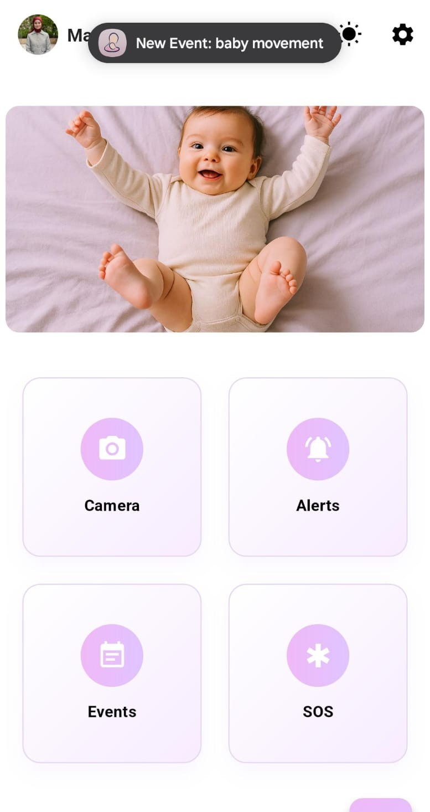

  

<!-- Project Overview -->

- **HearYou** is a smart safety system designed to support deaf and hard-of-hearing mothers. It helps them stay aware of important events at home, such as when the baby cries, someone knocks on the door, a phone call comes in, or other significant activities occur.  
  #Accessibility #Inclusion  

- The system consists of two main components: a mobile application and a physical bracelet.  
  #IoT #MobileApp #WearableTech  

  - **Digital Part (Mobile Application):**
    - Includes an SOS emergency call feature and live video streaming, allowing the mother to monitor her baby while sleeping.  
    - Provides weekly reports with recommendations based on the last 10 events of the week.  
    - Features an AI assistant to simplify control of settings, such as customizing event colors, setting quiet hours, prioritizing events, and enabling or disabling vibration.  
    #AI #MachineLearning #MobileDevelopment #HealthTech  

  - **Physical Part (Bracelet):**
    - Contains a vibration motor to notify the mother when an event occurs.  
    - Uses an RGB light to indicate the type of event.  
    #Wearables #Hardware #MothersSafety

  

<!-- System Design -->

- Component Diagram  
  
  

- ER Diagram  
  
<a href="https://app.eraser.io/workspace/MvIk4i8OynC0sq9c8MB3" target="_blank">Open in Eraser</a>
  

- Circuit Design  
  
  

- n8n overflow 
  
  

<!-- Project Highlights -->

**The Most Remarkable Features**

- **Seamless IoT Data Ingestion:** The system captures and securely stores real-time energy consumption data from client devices using ESP32 microcontrollers.  

- **AI-Powered Consumption Forecasting:** Advanced AI models analyze historical patterns to help energy providers anticipate demand and optimize resource allocation.  

- **Personalized AI Optimization Plans:** Clients receive intelligent, data-driven strategies to optimize energy usage, reduce costs, and promote sustainability based on their consumption behaviors.  

- **Future Works:** For the future, I am planning to include a fire detection system in the baby’s room. The goal of this feature is to quickly detect any signs of fire, so the system can help prevent dangerous situations and reduce the risk of harm for both the baby and the family.

  

<!-- Demo -->

### User Screens (Mobile)

| Login Screen                            | Settings Screen                       | Ai Agent Screen                       |
| --------------------------------------- | ------------------------------------- | ------------------------------------- |
|           |          |         |

| ML Baby Movement                        | Phone Calling Notification                   | Baby Movement Notification                  |
| --------------------------------------- | ------------------------------------       | -------------------------------------       |
|  |         |   |

- Arduino was used for the IoT part, with a push button serving as a prototype for the doorbell. An RGB LED combined with a vibration motor was implemented to notify the mother about the type of event that occurred.

| Bracelet Prototype                         | Bracelet Prototype                    | Bracelet Prototype                    |
| ---------------------------------------    | ------------------------------------- | ------------------------------------- |
|             |       |       |

| Alerts Page                                | Live Video Streaming                  | SOS Emergency Call                     |  
| ---------------------------------------    | ------------------------------------- | -------------------------------------- |
|               |          |            |

| Weekly Reports Page                        |  Dark Mode 1                          |  Dark Mode 2                             |
| ---------------------------------------    | ------------------------------------- | -------------------------------------   |
|              |       |       |

  

<!-- Development & Testing -->

| Services                                | Linear                             | 
| --------------------------------------- | ------------------------------------- | 
|        |          | 

  

- **Validation:** Validation ensures that user inputs, such as email, password, and form fields, meet specific rules and constraints before proceeding. For example, in the code, checks are performed to confirm that fields are not empty, passwords match, and the email format is valid.

| Validation                                | Validation                            | 
| -------------------------------------     | ------------------------------------- | 
|         |     | 

  

- **Machine Learning Models:** Machine learning is used to detect baby crying and movements. The models applied are:
  - **Baby crying detection:** Google **YAMNet** (from TensorFlow Hub `yamnet/1`), which classifies audio signals and identifies crying sounds.  
  - **Baby movement detection:** **MediaPipe Holistic (Pose)** to extract body keypoints, with movement logic handled using rule-based analysis rather than a separate ML classifier.

Baby Crying Detection ML                                       | Baby Movement Detection ML                 | 
-------------------------------------     | ------------------------------------- | 
                 |             |

  

- **AI Agent:** The AI agent acts as a smart controller for system settings. Instead of navigating menus, users can type simple requests like *“turn on vibration”* or *“set quiet hours to 10 PM”*. The AI interprets these commands and applies the changes directly in the backend, making the system more intuitive and user-friendly.

| AI Agent Flow                 | 
| ------------------------------------- | 
|             |

  

<!-- Deployment -->

### Feature Development
- New work is started on a local Git branch and pushed to GitHub.

### Integration to Staging
- The feature branch is merged into `staging`, which triggers GitHub Actions.

### Continuous Integration (CI) on Staging
- **Environment Setup:** GitHub Actions sets up Python 3.12 and Flutter.  
- **Database:** A temporary MongoDB service is provisioned for tests.  
- **Server Tasks:** 
  - Installs dependencies from `requirements.txt`.  
  - Runs linting and smoke tests.  
  - Builds the Docker image from `Server/Dockerfile` (Flask + Gunicorn entry: `api_server:create_app()`).  
- **Mobile App Tasks:** 
  - Runs `flutter pub get`.  
  - Runs `flutter analyze`.  
  - Builds an Android staging APK (artifact).  
- **Secrets Injection:** Required staging secrets are injected, including `MONGODB_URI`, `DB_NAME`, `FCM_SERVER_KEY`, `FIREBASE_RTDB_URL`, `GOOGLE_API_KEY`, and `API_BASE` (pointing to the staging API).

### Staging Deployment
- The built server Docker image is pushed and deployed to the staging EC2 instance.  
- A deployment script pulls the image and runs the Flask API container (behind VM/NGINX as configured), connecting to the staging MongoDB.  
- The Flutter staging APK from the pipeline is shared for QA, configured with `API_BASE` pointing to the staging API.

### Production Release
- After approval, `staging` is merged into `main`, re-triggering the pipeline.  
- The same CI steps run; deployment targets the production EC2 instance with production `MONGODB_URI` and secrets.  
- The mobile app is built as a signed Android AAB/APK for the Play Console, configured with production `API_BASE`.

| Deployement                             |
| --------------------------------------- | 
|          | 
  

  

- **Swagger:** Swagger is an API documentation and testing tool that provides a clear interface to explore, validate, and interact with backend endpoints.

Swagger APIs                             | Settings Testing                         | Connection Testing                             | 
------------------------------------- | ------------------------------------- | ------------------------------------- | 
       |        |        | 
